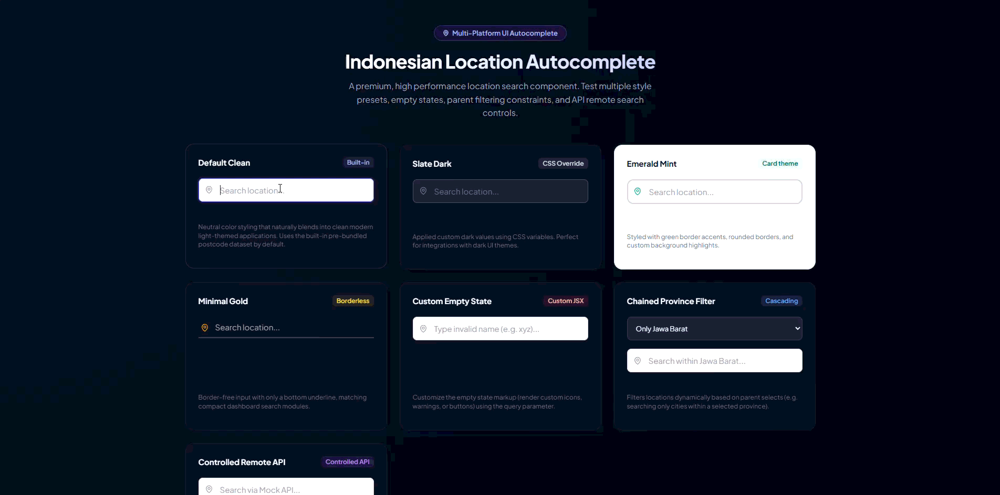
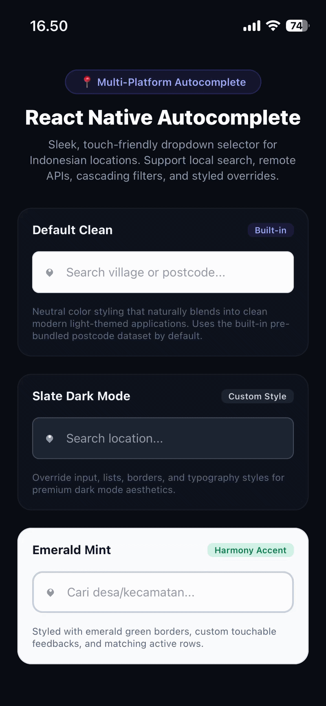
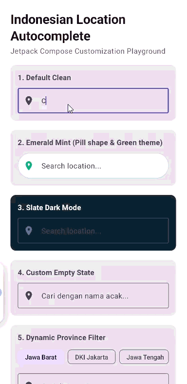
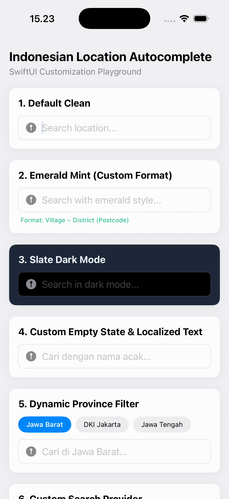

# Indonesian Location Autocomplete

A robust, lightweight, and blazing fast multi-platform location autocomplete library for Indonesian administrative areas (Province, Regency, District, Village, and Postcode).

Designed from the ground up to be **fully customizable**, it gives you total control over text translations, input styles, loader components, dropdown layouts, and theme tokens on every single supported platform, allowing it to seamlessly match your app's unique design system.

This monorepo contains native implementations for all major frontend frameworks and mobile platforms:

- **React JS (Web):** Modern, fully styled custom input with micro-animations and keyboard navigation support.
- **React Native (Mobile):** Sleek, touch-friendly dropdown/autocomplete list optimized for iOS and Android.
- **Android Jetpack Compose (Kotlin):** Premium native Compose UI component with material elements and smooth entry transitions.
- **Swift (iOS/SwiftUI):** Native Declarative SwiftUI component with standard iOS layouts.

## Previews

### React (Web)



### React Native (Mobile)



### Android (Jetpack Compose)



### iOS (SwiftUI)



## Monorepo Layout

```
indonesian-location-autocomplete/
├── README.md
├── packages/
│   ├── core/                  # Core package (logic & raw data)
│   │   ├── package.json
│   │   └── src/
│   │       ├── index.ts       # Shared logic (debounced search engine)
│   │       └── data/
│   │           └── indonesia-postcodes.json # Raw postcode database
│   ├── react/                 # React JS & React Native UI implementation
│   ├── android/               # Kotlin Jetpack Compose library
│   └── ios/                   # Swift / SwiftUI library package
└── examples/
    ├── react-demo/            # React JS Web playground
    ├── react-native-demo/     # React Native Expo App playground
    ├── android-demo/          # Native Kotlin Jetpack Compose App
    └── ios-demo/              # Native Swift / SwiftUI Xcode App

```

## Example Projects

To see the components in action, explore the playground apps in the `examples/` directory:

- **[React Web Demo](./examples/react-demo)** - A modern Next.js/Vite React app showing custom styles, text localization, and theme overrides.
- **[React Native Demo](./examples/react-native-demo)** - An Expo-based mobile app showing custom dropdown sheets and responsive input sizing.
- **[Android Jetpack Compose Demo](./examples/android-demo)** - A native Kotlin app showcasing material themes and soft-keyboard focus interactions.
- **[iOS SwiftUI Demo](./examples/ios-demo)** - A native Xcode SwiftUI app showing simple form binding and light/dark mode adaptation.

## How It Works

The autocomplete engine searches over the official Indonesian Postcode Database.
Each record contains:

- `code` (Postcode number)
- `village` (Kelurahan)
- `district` (Kecamatan)
- `regency` (Kota/Kabupaten)
- `province` (Provinsi)

The search query is debounced and queried locally or via an API client to instantly fetch matches matching the hierarchy query.

### 🌎 Cross-Platform Architecture & Asset Compatibility

To guarantee that this library works flawlessly on **every single platform** without dependency conflicts, the **search logic** is decoupled from the **asset loading**:

1. **Shared Pure Search Interface:** The core package exports a pure, stateless filtering engine `searchLocations(query, data)` which depends on zero platform-specific APIs.
2. **Platform-Native Data Loading:** Each native UI component handles JSON loading using its ecosystem's native asset pipeline:
   - **React (Web):** Dynamic/static ESM imports (`import data from ...`).
   - **React Native (Expo/Metro):** Bundled asset resolution (`require(...)`).
   - **Android (Kotlin):** Read from `assets/` folder using streaming JSON deserialization (`kotlinx.serialization`).
   - **Swift (iOS):** Read from the app bundle using `Foundation.Bundle` and `JSONDecoder`.

## Usage & Customization Guide

### 1. React Web Component

#### Installation

```bash
npm install @hudiohizari/indonesian-location-autocomplete-core @hudiohizari/indonesian-location-autocomplete
```

#### API Props Reference

- `value: string` (Required) - Controlled input value.
- `onLocationSelect: (location: LocationRecord) => void` (Required) - Invoked when selection occurs.
- `onQueryChange?: (query: string) => void` (Optional) - Invoked on input query keystrokes.
- `data?: LocationRecord[]` (Optional) - Postcode database. (Optional when using `searchResults`).
- `searchResults?: LocationRecord[]` (Optional) - Controlled pre-filtered search results (bypasses internal local search entirely, perfect for mock/live APIs).
- `isLoading?: boolean` (Optional) - Controlled loading spinner trigger.
- `debounceMs?: number` (Optional) - Delay in ms. Default is `300`.
- `searchOptions?: SearchOptions` (Optional) - Includes `maxResults`, `minQueryLength`, and a custom callback `filter: (loc: LocationRecord) => boolean` to restrict query suggestions dynamically.
- `texts?: { placeholder?: string; noResults?: string }` (Optional) - Custom translations.
- `leadingIcon?: React.ReactNode` (Optional) - Custom input icon. Set to `null` to hide.
- `loaderContent?: React.ReactNode` (Optional) - Custom loading content component. Set to `null` to hide.
- `renderItem?: (loc: LocationRecord, index: number, active: boolean) => React.ReactNode` (Optional) - Custom cell suggestion layout builder.
- `renderEmptyState?: (query: string) => React.ReactNode` (Optional) - Custom empty state indicator layout builder.
- `formatSelectedLocation?: (loc: LocationRecord) => string` (Optional) - Format value mapping upon selection.
- `className?: string` (Optional) - Input CSS class.
- `containerClassName?: string` (Optional) - Container CSS class.
- `containerStyle?: React.CSSProperties` (Optional) - Container inline styles.
- `dropdownClassName?: string` (Optional) - Dropdown wrapper CSS class.
- `dropdownStyle?: React.CSSProperties` (Optional) - Dropdown wrapper inline styles.

#### Presets & Usecases Examples

##### A. Zero-Configuration Pre-Bundled Component (Instant Setup)

If you want a robust, out-of-the-box local autocomplete component without importing or managing the postcode dataset manually:

```tsx
import { useState } from "react";
import { IndonesianLocationAutocomplete } from "@hudiohizari/indonesian-location-autocomplete";

function EasySearch() {
  const [value, setValue] = useState("");
  return (
    <IndonesianLocationAutocomplete
      value={value}
      onQueryChange={setValue}
      onLocationSelect={(loc) => setValue(`${loc.village}, ${loc.district}`)}
    />
  );
}
```

##### B. Custom Local JSON Search Mode (Flexible Loading)

```tsx
import { useState } from "react";
import { IndonesianLocationAutocomplete } from "@hudiohizari/indonesian-location-autocomplete";
import postcodeDataRaw from "@hudiohizari/indonesian-location-autocomplete-core/data";
import type { LocationRecord } from "@hudiohizari/indonesian-location-autocomplete";

const postcodeData = postcodeDataRaw as unknown as LocationRecord[];

function CustomSearch() {
  const [value, setValue] = useState("");
  return (
    <IndonesianLocationAutocomplete
      value={value}
      data={postcodeData}
      onQueryChange={setValue}
      onLocationSelect={(loc) => setValue(`${loc.village}, ${loc.district}`)}
    />
  );
}
```

##### C. Dynamic Parent Filtering (Chained Dropdowns)

```tsx
import { useState } from "react";
import { IndonesianLocationAutocomplete } from "@hudiohizari/indonesian-location-autocomplete";
import postcodeDataRaw from "@hudiohizari/indonesian-location-autocomplete-core/data";
import type { LocationRecord } from "@hudiohizari/indonesian-location-autocomplete";

const postcodeData = postcodeDataRaw as unknown as LocationRecord[];

function ChainedDropdowns() {
  const [value, setValue] = useState("");
  const [selectedProvince, setSelectedProvince] = useState("Jawa Barat");

  return (
    <IndonesianLocationAutocomplete
      value={value}
      data={postcodeData}
      onQueryChange={setValue}
      onLocationSelect={(loc) => setValue(`${loc.village}, ${loc.district}`)}
      searchOptions={{
        filter: (loc) => loc.province === selectedProvince,
      }}
    />
  );
}
```

##### D. Controlled Remote API Search (Zero 15MB file loads in browser)

> [!TIP]
> To minimize your client bundle size, you can install `@hudiohizari/indonesian-location-autocomplete-core` directly on your server/backend (Node.js, Bun, Deno). Your backend API can import `searchLocations` and query the raw JSON database, allowing you to feed results to the frontend via `searchResults` without sending the 15MB database to the browser.

```tsx
import { useState, useEffect } from "react";
import { IndonesianLocationAutocomplete } from "@hudiohizari/indonesian-location-autocomplete";

function RemoteAPISearch() {
  const [value, setValue] = useState("");
  const [results, setResults] = useState([]);
  const [loading, setLoading] = useState(false);

  useEffect(() => {
    if (value.length < 3) return;
    setLoading(true);
    fetch(`/api/locations?q=${value}`)
      .then((res) => res.json())
      .then((data) => {
        setResults(data);
        setLoading(false);
      });
  }, [value]);

  return (
    <IndonesianLocationAutocomplete
      value={value}
      onQueryChange={setValue}
      onLocationSelect={(loc) => setValue(loc.village)}
      searchResults={results}
      isLoading={loading}
    />
  );
}
```

##### E. Visual Styling Customizations via CSS variables

```css
/* Customize your app stylesheet using clean fallback tokens */
.my-custom-input {
  --ila-input-border-radius: 12px;
  --ila-focus-border-color: #10b981;
  --ila-dropdown-bg: #1f2937;
  --ila-item-primary-color: #f3f4f6;
  --ila-loader-color: #10b981;
}
```

---

### 2. React Native Component

#### Installation

```bash
npm install @hudiohizari/indonesian-location-autocomplete-core @hudiohizari/indonesian-location-autocomplete
```

> [!TIP]
> **TypeScript Configuration:**
> To ensure the standard TypeScript compiler (`tsc`) correctly prioritizes React Native `.native.tsx` source exports over Web `.tsx` source exports, add `"moduleSuffixes": [".native", ""]` to your React Native project's `tsconfig.json` compilerOptions:
>
> ```json
> {
>   "compilerOptions": {
>     "moduleSuffixes": [".native", ""]
>   }
> }
> ```

#### API Props Reference

- `value: string` (Required) - Controlled input query value.
- `onLocationSelect: (location: LocationRecord) => void` (Required) - Invoked when selection occurs.
- `onQueryChange?: (query: string) => void` (Optional) - Invoked on input query keystrokes.
- `data?: LocationRecord[]` (Optional) - Postcode database. (Optional when using `searchResults`).
- `searchResults?: LocationRecord[]` (Optional) - Controlled pre-filtered search results (perfect for off-thread SQLite/API querying).
- `isLoading?: boolean` (Optional) - Controlled loading spinner trigger.
- `debounceMs?: number` (Optional) - Delay in ms. Default is `300`.
- `searchOptions?: SearchOptions` (Optional) - Includes `maxResults`, `minQueryLength`, and a custom callback `filter: (loc: LocationRecord) => boolean` to restrict query suggestions dynamically.
- `texts?: { placeholder?: string; noResults?: string }` (Optional) - Custom translations.
- `leadingIcon?: React.ReactNode` (Optional) - Custom input icon. Set to `null` to hide.
- `loaderContent?: React.ReactNode` (Optional) - Custom loading content component. Set to `null` to hide.
- `renderItem?: (loc: LocationRecord, index: number, active: boolean) => React.ReactNode` (Optional) - Custom suggestion item layout builder.
- `renderEmptyState?: (query: string) => React.ReactNode` (Optional) - Custom empty state layout builder.
- `formatSelectedLocation?: (loc: LocationRecord) => string` (Optional) - Format value mapping upon selection.
- `disabled?: boolean` (Optional) - Whether the input is disabled. Default is `false`.

**React Native Specific Style Props:**

- `style?: StyleProp<ViewStyle>` - Styles applied to the main wrapper View.
- `inputWrapperStyle?: StyleProp<ViewStyle>` - Styles applied to the input wrapper View (holds TextInput, leading icon, and loader).
- `inputStyle?: StyleProp<TextStyle>` - Styles applied to the TextInput element.
- `dropdownStyle?: StyleProp<ViewStyle>` - Styles applied to the dropdown container.
- `itemStyle?: StyleProp<ViewStyle>` - Styles applied to the individual list item TouchableOpacity container.
- `itemTextStyle?: StyleProp<TextStyle>` - Styles applied to the primary suggestion text.
- `itemSubTextStyle?: StyleProp<TextStyle>` - Styles applied to the secondary suggestion subtext.
- `emptyStyle?: StyleProp<ViewStyle>` - Styles applied to the empty list result wrapper.
- `emptyTextStyle?: StyleProp<TextStyle>` - Styles applied to the empty state text.

#### Presets & Usecases Examples

##### A. Zero-Configuration Pre-Bundled Component (Instant Setup)

If you want a robust, out-of-the-box local autocomplete component without importing or managing the postcode dataset manually:

```tsx
import { useState } from "react";
import { IndonesianLocationAutocomplete } from "@hudiohizari/indonesian-location-autocomplete";

function EasySearch() {
  const [value, setValue] = useState("");
  return (
    <IndonesianLocationAutocomplete
      value={value}
      onQueryChange={setValue}
      onLocationSelect={(loc) => setValue(`${loc.village}, ${loc.district}`)}
    />
  );
}
```

##### B. Custom Search (Local JSON Data - Flexible Loading)

```tsx
import { useState } from "react";
import { IndonesianLocationAutocomplete } from "@hudiohizari/indonesian-location-autocomplete";
import postcodeDataRaw from "@hudiohizari/indonesian-location-autocomplete-core/data";
import type { LocationRecord } from "@hudiohizari/indonesian-location-autocomplete";

const postcodeData = postcodeDataRaw as unknown as LocationRecord[];

function CustomSearch() {
  const [value, setValue] = useState("");
  return (
    <IndonesianLocationAutocomplete
      value={value}
      data={postcodeData}
      onQueryChange={setValue}
      onLocationSelect={(loc) => setValue(`${loc.village}, ${loc.district}`)}
    />
  );
}
```

##### C. Dynamic Parent Filtering (Chained Dropdowns)

```tsx
import { useState } from "react";
import { IndonesianLocationAutocomplete } from "@hudiohizari/indonesian-location-autocomplete";
import postcodeDataRaw from "@hudiohizari/indonesian-location-autocomplete-core/data";
import type { LocationRecord } from "@hudiohizari/indonesian-location-autocomplete";

const postcodeData = postcodeDataRaw as unknown as LocationRecord[];

function ChainedDropdowns() {
  const [value, setValue] = useState("");
  const [selectedProvince] = useState("DKI Jakarta");

  return (
    <IndonesianLocationAutocomplete
      value={value}
      data={postcodeData}
      onQueryChange={setValue}
      onLocationSelect={(loc) => setValue(`${loc.village}, ${loc.district}`)}
      searchOptions={{
        filter: (loc) => loc.province === selectedProvince,
      }}
    />
  );
}
```

##### D. Custom Styling (Dark Mode Accent)

```tsx
import { useState } from "react";
import { StyleSheet } from "react-native";
import { IndonesianLocationAutocomplete } from "@hudiohizari/indonesian-location-autocomplete";
import postcodeDataRaw from "@hudiohizari/indonesian-location-autocomplete-core/data";
import type { LocationRecord } from "@hudiohizari/indonesian-location-autocomplete";

const postcodeData = postcodeDataRaw as unknown as LocationRecord[];

function DarkModeSearch() {
  const [value, setValue] = useState("");
  return (
    <IndonesianLocationAutocomplete
      value={value}
      data={postcodeData}
      onQueryChange={setValue}
      onLocationSelect={(loc) => setValue(loc.village)}
      inputWrapperStyle={styles.wrapper}
      inputStyle={styles.input}
      dropdownStyle={styles.dropdown}
      itemTextStyle={styles.itemText}
    />
  );
}

const styles = StyleSheet.create({
  wrapper: { backgroundColor: "#1e293b", borderColor: "#475569" },
  input: { color: "#f8fafc" },
  dropdown: { backgroundColor: "#1e293b", borderColor: "#475569" },
  itemText: { color: "#f8fafc" },
});
```

---

### 3. Android Jetpack Compose Component

#### Installation

For **JitPack**:

1. Add the JitPack repository to your root `settings.gradle.kts`:

```kotlin
dependencyResolutionManagement {
    repositories {
        google()
        mavenCentral()
        maven { url = uri("https://jitpack.io") }
    }
}
```

2. Add the dependency to your app's `build.gradle.kts`:

```kotlin
implementation("com.github.hudiohizari:indonesian-location-autocomplete:v1.0.5")
```

> [!TIP]
> **Performance Optimization (Eager Loading):**
> Because the postcode database is a relatively large JSON dataset (~15MB), parsing it on the first search can cause a minor delay. You can eager-load the database in the background at app startup (e.g. in your Activity's `onCreate`) to ensure searches are instant from the very first keystroke:
>
> ```kotlin
> val searchEngine = LocationSearchEngine(applicationContext)
> // Eagerly pre-load database in the background
> lifecycleScope.launch {
>     searchEngine.init()
> }
> ```
>
> Alternatively, the `IndonesianLocationAutocomplete` composable will automatically start background pre-loading in a `LaunchedEffect` as soon as it is composed.

#### API Parameters Reference

- `value: String` (Required) - Controlled query.
- `onQueryChange: (String) -> Unit` (Required) - Keystroke callback.
- `onLocationSelect: (LocationRecord) -> Unit` (Required) - Selection callback.
- `searchEngine: LocationSearchEngine?` (Optional) - Default database helper. (Optional when using `searchProvider`).
- `maxResults: Int` - Maximum rows.
- `minQueryLength: Int` - Minimum typing length.
- `debounceMs: Long` - Search delay in ms.
- `texts: AutocompleteTexts` - Placeholder & Empty translations.
- `shape: Shape` - Input border shape.
- `colors: TextFieldColors` - Input text field colors.
- `dropdownModifier: Modifier` - Styles applied to the dropdown container.
- `leadingIcon: @Composable (() -> Unit)?` - Customize or hide leading icon.
- `loaderContent: @Composable (() -> Unit)?` - Customize or hide loading spinner.
- `itemContent: @Composable (ColumnScope.(LocationRecord) -> Unit)?` - Custom item layout builder.
- `emptyContent: @Composable (ColumnScope.(query: String) -> Unit)?` - Custom empty state layout builder.
- `formatSelectedLocation: (LocationRecord) -> String` - Mapping of selected records.
- `filter: ((LocationRecord) -> Boolean)?` - Filters search results dynamically.
- `searchProvider: (suspend (String) -> List<LocationRecord>)?` - Controlled search provider (runs Room/SQL/API off-thread).

#### Presets & Usecases Examples

##### A. Standard Search

```kotlin
val searchEngine = remember { LocationSearchEngine(context) }
var query by remember { mutableStateOf("") }

IndonesianLocationAutocomplete(
    value = query,
    onQueryChange = { query = it },
    onLocationSelect = { loc -> query = loc.village },
    searchEngine = searchEngine
)
```

##### B. Dynamic Parent Filter

```kotlin
val searchEngine = remember { LocationSearchEngine(context) }
var query by remember { mutableStateOf("") }
var targetProvince by remember { mutableStateOf("DKI Jakarta") }

IndonesianLocationAutocomplete(
    value = query,
    onQueryChange = { query = it },
    onLocationSelect = { loc -> query = loc.village },
    searchEngine = searchEngine,
    filter = { loc -> loc.province == targetProvince }
)
```

##### C. Custom Search Provider (Room / Background API Querying)

```kotlin
var query by remember { mutableStateOf("") }

IndonesianLocationAutocomplete(
    value = query,
    onQueryChange = { query = it },
    onLocationSelect = { loc -> query = loc.village },
    searchProvider = { q ->
        // Executes off-thread to search background REST API or Room Database
        myLocationDao.searchLocs(q)
    }
)
```

### 4. iOS SwiftUI Component

#### Installation (Swift Package Manager)

To integrate the library package into your Xcode project:

1. In Xcode, select **File > Add Package Dependencies...**
2. Paste your repository URL: `https://github.com/hudiohizari/indonesian-location-autocomplete.git`
3. Select the version tag (e.g. `v1.0.5`) or branch you wish to use.

#### API Parameters Reference

- `value: Binding<String>` (Required) - Controlled binding query.
- `onQueryChange: (String) -> Void` (Required) - Keystroke callback.
- `onLocationSelect: (LocationRecord) -> Void` (Required) - Selection callback.
- `searchEngine: LocationSearchEngine?` (Optional) - Local search engine helper. (Optional when using `searchProvider`).
- `maxResults: Int` - Maximum results. Default: `10`.
- `minQueryLength: Int` - Minimum typing length. Default: `3`.
- `debounceMs: Int` - Debounce search delay in ms. Default: `300`.
- `texts: AutocompleteTexts` - Placeholder & Empty translations.
- `enabled: Bool` - Interactive enablement state. Default: `true`.
- `filter: ((LocationRecord) -> Bool)?` - Filter callback.
- `searchProvider: ((String) async -> [LocationRecord])?` - Controlled async background search provider.

#### Presets & Usecases Examples

##### A. Standard Search

```swift
import SwiftUI
import IndonesianLocationAutocomplete

struct EasySearch: View {
    @StateObject private var searchEngine = LocationSearchEngine()
    @State private var query = ""

    var body: some View {
        IndonesianLocationAutocomplete(
            value: $query,
            onQueryChange: { query = $0 },
            onLocationSelect: { loc in
                query = "\(loc.village), \(loc.district)"
            },
            searchEngine: searchEngine
        )
    }
}
```

##### B. Dynamic Parent Filtering

```swift
import SwiftUI
import IndonesianLocationAutocomplete

struct FilteredSearch: View {
    @StateObject private var searchEngine = LocationSearchEngine()
    @State private var query = ""
    @State private var targetProvince = "DKI Jakarta"

    var body: some View {
        IndonesianLocationAutocomplete(
            value: $query,
            onQueryChange: { query = $0 },
            onLocationSelect: { loc in
                query = "\(loc.village), \(loc.district)"
            },
            searchEngine: searchEngine,
            filter: { loc in loc.province == targetProvince }
        )
    }
}
```

##### C. Custom Async Provider (Core Search on Server / API)

```swift
import SwiftUI
import IndonesianLocationAutocomplete

struct RemoteSearch: View {
    @State private var query = ""
    @State private var results: [LocationRecord] = []

    var body: some View {
        IndonesianLocationAutocomplete(
            value: $query,
            onQueryChange: { query = $0 },
            onLocationSelect: { loc in
                query = loc.village
            },
            searchProvider: { q in
                // Executes off-thread to query your custom REST API or Local Database
                return await myApi.fetchLocations(query: q)
            }
        )
    }
}
```

---

## Tested & Supported Platforms

- [x] React 18+ / React 19 (Web)
- [x] React Native (Android)
- [x] React Native (iOS)
- [x] Android Jetpack Compose (Kotlin 1.9+, Android SDK 24+)
- [x] iOS SwiftUI (iOS 15+, Swift 5.9+)

## Distribution & Publishing Targets

Native packages are published directly to the standard registry of each platform:

- **React JS & React Native:** [npm Registry](https://www.npmjs.com/)
- **Android Jetpack Compose:** [Maven Central](https://search.maven.org/) / [JitPack](https://jitpack.io/)
- **iOS SwiftUI:** [Swift Package Manager (GitHub)](https://github.com/apple/swift-package-manager)

## Library Deployment Status

- [x] `@hudiohizari/indonesian-location-autocomplete` (npm - Unified Web & React Native)
- [x] `com.github.hudiohizari:indonesian-location-autocomplete` (JitPack - Android)
- [x] `IndonesianLocationAutocomplete` (Swift Package Manager - iOS)

---

## Deployment & Publishing Guide

### 1. React & React Native (npm)

1. Log in to npm:
   ```bash
   npm login
   ```
2. Publish the package:
   ```bash
   npm publish --workspace=packages/react --access public
   ```

### 2. Android Jetpack Compose (JitPack)

Android packages are distributed via JitPack using GitHub release tags:

1. Apply the `maven-publish` plugin in `packages/android/build.gradle`.
2. Configure a `jitpack.yml` at the root of the project if specific JDK versions are required.
3. Publish by creating a new GitHub Release.

### 3. Automated CI/CD (GitHub Actions)

Continuous integration and deployment pipelines are configured under `.github/workflows`:

#### Continuous Integration (`ci.yml`)

- Automatically triggers on every push and pull request to the `main` branch.
- Installs monorepo dependencies, runs core search engine unit tests, typechecks both JavaScript/TypeScript components (`packages/core` & `packages/react`), and builds the React web demo workspace.
- Sets up JDK 17 to validate that the Android library (`packages/android`) compiles successfully.

#### Automated NPM Release (`release.yml`)

- Automatically publishes workspace packages to the npm Registry when a version tag is pushed (e.g. `v1.0.5`).
- Runs all test validations first before deploying.
- Publishes the core library (`@hudiohizari/indonesian-location-autocomplete-core`) followed by the React library (`@hudiohizari/indonesian-location-autocomplete`) sequentially.

**Setup Instructions**:

1. Generate an Access Token (Publish type) on [npm](https://www.npmjs.com/).
2. In your GitHub repository settings, navigate to **Settings > Secrets and variables > Actions**.
3. Create a new repository secret named `NPM_TOKEN` and paste your npm Access Token.
4. When ready to publish, tag the commit and push:
   ```bash
   git tag v1.0.5
   git push origin v1.0.5
   ```

---

## License

MIT © 2026
